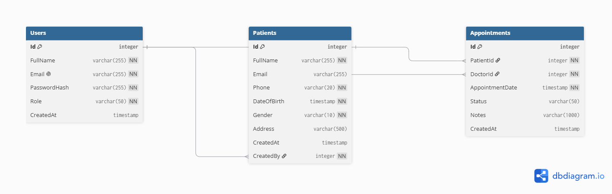

# Healthcare CRM — Entity Relationship Diagram

# Healthcare CRM — ERD

## Tables

### Users
| Column | Type | Constraints |
|--------|------|-------------|
| Id | INT | PRIMARY KEY, IDENTITY |
| FullName | NVARCHAR(255) | NOT NULL |
| Email | NVARCHAR(255) | NOT NULL, UNIQUE |
| PasswordHash | NVARCHAR(255) | NOT NULL |
| Role | NVARCHAR(50) | NOT NULL, DEFAULT 'Admin' |
| CreatedAt | DATETIME | DEFAULT GETUTCDATE() |

### Patients
| Column | Type | Constraints |
|--------|------|-------------|
| Id | INT | PRIMARY KEY, IDENTITY |
| FullName | NVARCHAR(255) | NOT NULL |
| Email | NVARCHAR(255) | NULL |
| Phone | NVARCHAR(20) | NOT NULL |
| DateOfBirth | DATETIME | NOT NULL |
| Gender | NVARCHAR(10) | NOT NULL |
| Address | NVARCHAR(500) | NULL |
| CreatedAt | DATETIME | DEFAULT GETUTCDATE() |
| CreatedBy | INT | FOREIGN KEY → Users(Id) |

### Appointments
| Column | Type | Constraints |
|--------|------|-------------|
| Id | INT | PRIMARY KEY, IDENTITY |
| PatientId | INT | FOREIGN KEY → Patients(Id) |
| DoctorId | INT | FOREIGN KEY → Users(Id) |
| AppointmentDate | DATETIME | NOT NULL |
| Status | NVARCHAR(50) | DEFAULT 'Scheduled' |
| Notes | NVARCHAR(1000) | NULL |
| CreatedAt | DATETIME | DEFAULT GETUTCDATE() |

## Relationships
- One **User** can create many **Patients** (CreatedBy)
- One **Patient** can have many **Appointments**
- One **User** (Doctor) can have many **Appointments**